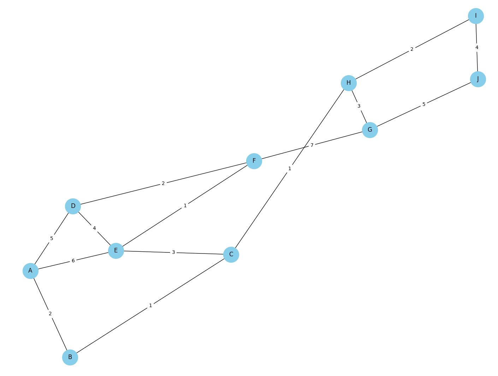
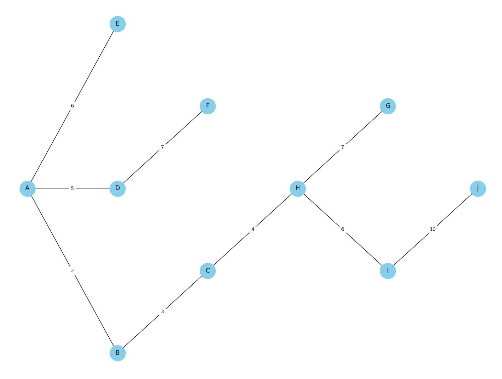
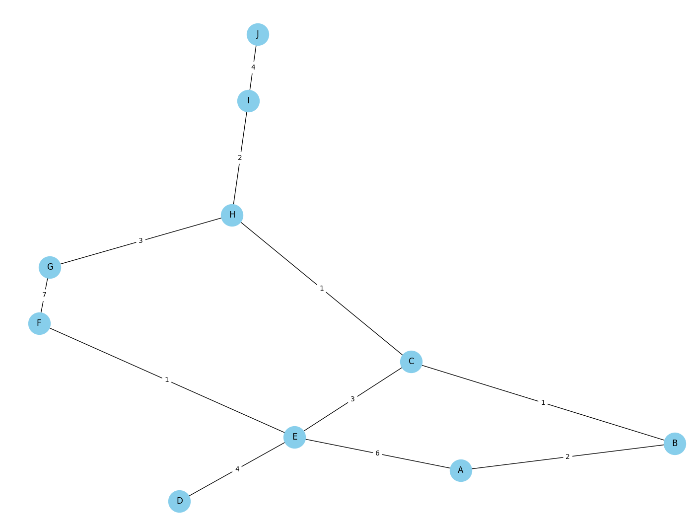
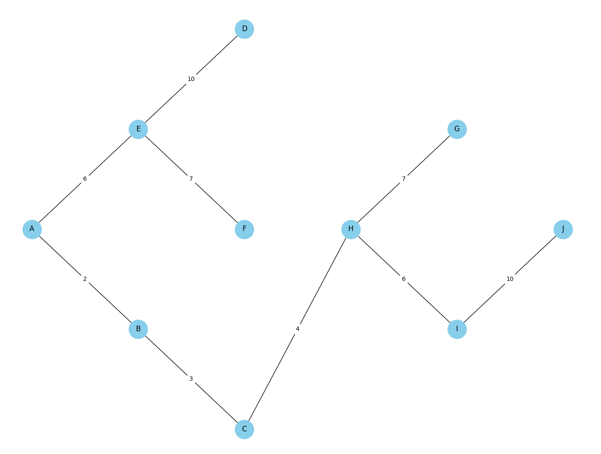
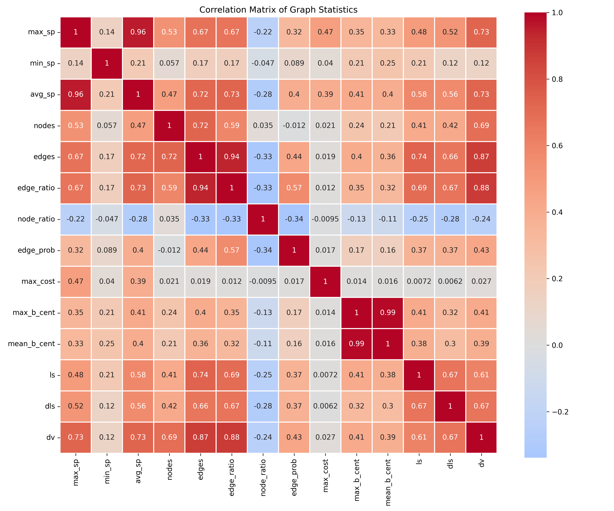

# CS513 Final Report

## Names

Team Lord of the Pings consists of: Alexander Beck, Jack Rothenberg

## Individual Contributions

- Alexander Beck
  - Console
  - Centrality & Stats
  - Tree plotting
  - Graph creation from file/console

- Jack Rothenberg
  - Link-state routing
  - Dijkstra
  - Graph manager
  - Network plotting

- Shared
  - Distributed link-state routing
  - Distance-vector routing
  - Report
  - Experiments
  - Analysis

## Selected Project

We selected the standard network layer routing project.

## Work Completed / Deviations From Standard Project

For this project we created a kernel to simulate several different routing algorithms for the analysis of sparse networks. We created and analyzed 3 different routing algorithms along with several visualization and analysis tools.

The kernel itself does not accept any command args, but is done by parsing standard input. It is made in a modular way that allows for easy creation of commands. The commands are parsed after checking for a graph addition/deletion (using the form "A B 10" or "A B -"). The command parser has commands for routing algorithms (talked about in the next paragraph), commands for visualizing the created graph, and commands for graph analysis. There are also flags you can pass to certain commands, such as "-i" to make the distance-vector algorithm run iteratively, or "-r" to reset the distance vectors.

When running the kernel using "help" or "help ls" will show information and usage about a command. To input a file of edges, run "file filename". You can exit the kernel by doing Ctrl + C or typing the "exit" command. Adding an edge is as simple as typing "A B 4", and removing it can be done through "A B -". Nodes are only single characters and costs must be positive integers.

The first algorithm is the link-state routing algorithm, which utilizes Dijkstra's algorithm on a centralized system. The link-state routing algorithm is called by using the "ls" command with the given node as the root node to calculate from (ls A). The second is the distance-vector routing algorithm, which utilizes every node keeping its own table and sharing information with its neighbors in a decentralized fashion. The distance-vector routing algorithm is called using the "dv" command with the given node as the root node to calculate from (dv A). This algorithm allows for the "-i" argument, which indicates that the algorithm should run incrementally (dv A -i). The third is a combination of the two and combines the usage of the optimal Dijkstra's algorithm on a decentralized system by having each node build and share its own graph based on the information shared by its neighbors and runs Dijkstra's on that graph. We are calling it the distributed link-state routing algorithm and it is called by using the "dls" command with the given node as the root node to calculate from. Similar to the "dv" command, this can also be ran with the "-i" parameter for iterative running.

In addition to the routing algorithms, we created several tools for analysis and visualization. For visualization, we created the "plot" and "tree" commands. The "plot" command plots the graph as constructed with the given nodes and costs. The "tree" command which plots a minimum spanning tree with the inputted node as the root node for the network graph (tree A). For analysis, we created the commands "centrality" and "stats". The "centrality" command calculates the betweenness of every node in the graph and prints the nodes with their betweenness, allowing us to see which nodes are most central to the network. The "stats" command prints the node with the maximum, minimum, and average shortest path lengths found in the graph.

## Results / Sample Runs With Outputs

Our results are separated into different experiments, listed as follows:

1. A [simple run](#simple-run) of the program
1. A showcase of [changing edges while running the distance vector routing algorithm](#changing-cost-dv)
1. [How the provided sample graph fares with the different routing algorithms](#time-to-converge)
1. A showcase of [the distance vector algorithm counting to infinity](#count-to-infinity)
1. [10000 randomized graphs and their statistics](#correlation-experiment)

### Simple Run

To run this simple run experiment, the following commands would need to be written into our custom kernel:

```
A D 5
D F 2
A B 2
A E 6
D E 4
E F 1
F G 7
B C 1
C E 3
C H 1
G H 3
H I 2
I J 4
G J 5

plot

ls A
tree A

A D -
D F -
G J -

plot

dv A
tree A
```

This code produces the following outputs (confirmation text and intermediary routing tables not shown for conciseness):





Running Link-State routing from A:
```
Routing Table for node A (Sorted by Cost):
A <- - (0)
B <- A (2)
D <- A (5)
E <- A (6)

...

Routing Table for node A (Sorted by Cost):
A <- - (0)
B <- A (2)
C <- B (3)
H <- C (4)
D <- A (5)
E <- A (6)
I <- H (6)
F <- D (7)
G <- H (7)
J <- I (10)
Link State Routing algorithm converged after 11 runs
```







Running Distance-Vector routing after removing edges:
```
Routing Table for node A (Sorted by Cost):
A <- - (0)
B <- C (2)
E <- C (6)

...

Routing Table for node A (Sorted by Cost):
A <- - (0)
B <- C (2)
C <- H (3)
H <- I (4)
E <- C (6)
I <- J (6)
F <- G (7)
G <- H (7)
D <- E (10)
J <- I (10)
The Distance Vector Routing Algorithm has converged! 
Any future use of the dv command with the same graph will not change the output.
Distance Vector Routing algorithm converged after 6 runs
```



Running the first set of these commands creates the graph. Running the "plot" command then displays the created graph. Running "ls A" will then run the Link-State routing algorithm with node A as the root node. It will print to the console the resulting routing table. Running the "tree" command will plot the resulting spanning tree. The next set of commands remove several edges from the graph. Running the "plot" command now shows the modified plot. Running "dv A" then updates the routing table using the Distance-Vector routing algorithm, also printing the results. Running the "tree" command again shows a slightly different spanning tree, reflecting the new graph.

### Changing Cost DV

To run this experiment, highlighting how the Distance-Vector algorithm reacts to changing edge costs, the following commands would need to be written into our custom kernel:

```
file figure1.in

dv A

A J 9
dv A

C J 1
dv A

C J 999
dv A
```

This code produces the following outputs (confirmation text and intermediary routing tables not shown for conciseness):

Initial routing table from distance-vector:
```
Routing Table for node A (Sorted by Cost):
A <- - (0)
B <- C (2)
D <- F (5)
E <- C (6)

...

Routing Table for node A (Sorted by Cost):
A <- - (0)
B <- C (2)
C <- H (3)
H <- C (4)
D <- F (5)
E <- C (6)
F <- G (7)
G <- H (7)
The Distance Vector Routing Algorithm has converged! 
Any future use of the dv command with the same graph will not change the output.
Distance Vector Routing algorithm converged after 5 runs
```

Running distance vector again after adding edge A J 9:
```
Routing Table for node A (Sorted by Cost):
A <- - (0)
B <- C (2)
C <- H (3)
H <- C (4)
D <- F (5)
E <- C (6)
F <- G (7)
G <- H (7)
J <- A (9)

...

Routing Table for node A (Sorted by Cost):
A <- - (0)
B <- C (2)
C <- H (3)
H <- C (4)
D <- F (5)
E <- C (6)
F <- G (7)
G <- H (7)
J <- A (9)
The Distance Vector Routing Algorithm has converged! 
Any future use of the dv command with the same graph will not change the output.
Distance Vector Routing algorithm converged after 3 runs
```

Running distance vector again after Adding C J 1:
```
Routing Table for node A (Sorted by Cost):
A <- - (0)
B <- C (2)
C <- J (3)
H <- C (4)
D <- F (5)
E <- C (6)
F <- G (7)
G <- H (7)
J <- C (9)

...

Routing Table for node A (Sorted by Cost):
A <- - (0)
B <- C (2)
C <- J (3)
H <- C (4)
J <- C (4)
D <- F (5)
E <- C (6)
F <- G (7)
G <- H (7)
The Distance Vector Routing Algorithm has converged! 
Any future use of the dv command with the same graph will not change the output.
Distance Vector Routing algorithm converged after 5 runs
```

After changing cost C J to 999:
```
Routing Table for node A (Sorted by Cost):
A <- - (0)
B <- C (2)
C <- H (3)
H <- C (4)
J <- A (4)
D <- F (5)
E <- C (6)
F <- G (7)
G <- H (7)

...

Routing Table for node A (Sorted by Cost):
A <- - (0)
B <- C (2)
C <- H (3)
H <- C (4)
D <- F (5)
E <- C (6)
F <- G (7)
G <- H (7)
J <- A (9)
The Distance Vector Routing Algorithm has converged! 
Any future use of the dv command with the same graph will not change the output.
```

Running the first command, "file figure1.in" generates the graph detailed in the "figure1.in" file. Running the command "dv A" then runs the Distance-Vector routing algorithm, printing the resulting routing table with node "A" as the root node. This takes 5 iterations to converge. The next commands add node "J" and connect it to the graph by node "A" with edge cost 9. Running the "dv A" command again now shows that the cheapest route to "J" is of cost 9, which is to be expected. This takes 3 iterations to converge, which makes sense as the routing table is mostly settled and this causes a very minimal change. Then, the next commands add another route to node "J" through node "C" with cost 1. Running "dv A" again now shows the cost to "J" from "A" is 4. Notably, this takes several iterations, with the routing table shifting as this new information travels through the system. This takes 5 iterations. Lastly, the cost of the edge between nodes "C" and "J" is increased to 999. This ensures that this edge should no longer be used and the cost should go back up to 9, as the cheapest route to node "J" is again directly through node "A". As the Distance-Vector algorithm allows for "good news" to travel quickly and "bad news" to travel slowly, it would be expected that this change would take significantly longer than the previous modification. This is exactly what we see with this change taking 9 iterations to converge, almost twice the time.

### Time to Converge

```
file figure1.in
dv A
dls A -r
ls A -r
```

This code produces the following outputs (confirmation text and intermediary routing tables not shown for conciseness):

Initial routing table from distance vector:
```
Routing Table for node A (Sorted by Cost):
A <- - (0)
B <- C (2)
D <- F (5)
E <- C (6)

...

Routing Table for node A (Sorted by Cost):
A <- - (0)
B <- C (2)
C <- H (3)
H <- C (4)
D <- F (5)
E <- C (6)
F <- G (7)
G <- H (7)
The Distance Vector Routing Algorithm has converged! 
Any future use of the dv command with the same graph will not change the output.
Distance Vector Routing algorithm converged after 5 runs
```

Running distributed link state routing after resetting:

```
Reset dls graphs.

Routing Table for node A (Sorted by Cost):
A <- - (0)
B <- A (2)
D <- A (5)
E <- A (6)

...

Routing Table for node A (Sorted by Cost):
A <- - (0)
B <- A (2)
C <- B (3)
H <- C (4)
D <- A (5)
E <- A (6)
F <- D (7)
G <- H (7)
Link State Routing algorithm converged after 9 runs
The Distance Vector Routing Algorithm has converged! 
Any future use of the dv command with the same graph will not change the output.
Distributed Link State Routing algorithm converged after 3 runs
```

Running link state routing after resetting:

```
Routing Table for node A (Sorted by Cost):
A <- - (0)
B <- A (2)
D <- A (5)
E <- A (6)

...

Routing Table for node A (Sorted by Cost):
A <- - (0)
B <- A (2)
C <- B (3)
H <- C (4)
D <- A (5)
E <- A (6)
F <- D (7)
G <- H (7)
Link State Routing algorithm converged after 9 runs
```

The time to converge experiment was done by running the different running algorithms on the same graph, and comparing how many times it took each to finish.

One interesting result is when running the different algorithms on a dense graph (specifically, every node connected to every other node). Distance Vector and Distributed link state finish in `2` runs, but link state takes `n + 1`. This is interesting because it is the opposite of a sparse graph, where it takes Distance Vector longer than Link State.

### Count to Infinity

```
A B 1
B C 1
C D 1

dv A

C D -

dv A -i
dv A -i
dv A -i
dv A -i
```

Entire code output (as this is a smaller-scale experiment):
```
Routing Table for node A (Sorted by Cost):
A <- - (0)
B <- C (1)

Routing Table for node A (Sorted by Cost):
A <- - (0)
B <- C (1)
C <- D (2)

Routing Table for node A (Sorted by Cost):
A <- - (0)
B <- C (1)
C <- D (2)
D <- C (3)

Routing Table for node A (Sorted by Cost):
A <- - (0)
B <- C (1)
C <- D (2)
D <- C (3)
The Distance Vector Routing Algorithm has converged! 
Any future use of the dv command with the same graph will not change the output.
Distance Vector Routing algorithm converged after 4 runs
Removed edge C-D

Routing Table for node A (Sorted by Cost):
A <- - (0)
B <- C (1)
C <- B (2)
D <- A (3)

Routing Table for node A (Sorted by Cost):
A <- - (0)
B <- C (1)
C <- B (2)
D <- A (3)

Routing Table for node A (Sorted by Cost):
A <- - (0)
B <- C (1)
C <- B (2)
D <- A (5)

Routing Table for node A (Sorted by Cost):
A <- - (0)
B <- C (1)
C <- B (2)
D <- A (7)
```

As an experiment to test the count-to-infinity problem with the distance vector routing algorithm, we designed a miniature experiment. This experiment follows the example shown in class for the count-to-infinity problem, with a straight line graph A-B-C-D of edge weights 1. After creating the graph, remove the C-D edge, and run the algorithm. The results show that A-D gets greater every iteration.

### Correlation Experiment

In this experiment, we generated 10000 random graphs. for tracking correlation between several variables. Each graph was constructed with a random number off nodes, edge probability, and max cost.

The number of nodes was specified to be between 3 and 26, the edge probability (how likely any given nodes are to being connected) was specified to be between 1% and 10%, and the max cost (the maximum cost allowed on any edge) was specified to be between 1 and 50.

For each of these 10000 graphs, several experiments were ran, generating various statistics. First, each of the graphs were saved as text and plots, then the Distance-Vector routing algorithm was ran, then the Distributed-Link-State routing algorithm, followed by the Link-State routing algorithm. Once the routing algorithms were ran, the betweenness centrality was found for all.

The collected statistics from each graph for correlation were:

- max_sp: The maximum shortest path length
- min_sp: The minimum shortest path length
- avg_sp: The average shortest path length
- nodes: The number of nodes in the graph
- edges: The number of edges in the graph
- edge_ratio: The ratio of the number of edges to nodes
- node_ratio: The ratio of the number of nodes to edges
- edge_cost: The probability that two nodes share an edge
- max_cost: The maximum allowed edge cost
- max_b_cent: The maximum betweenness centrality of the nodes
- mean_b_cent: The average betweenness centrality of the nodes




Regarding the link state algorithm, it is most strongly correlated with the number of edges and the edge ratio, but is also correlated with the number of nodes and the average shortest path. This is to be expected as all routing algorithms benefit from shorter paths. It is also negatively correlated to the node ratio, which is to be expected as a more sparse graph is quicker to process. Additionally, as the number of nodes and edges increases, it has more to search over, increasing the runtime. It is also strongly correlated to the runtime for the other algorithms, interestingly equally so.

Regarding the distributed link state algorithm, it has approximately the same correlations as the link state algorithm. This is to be expected as it effectively is the link state algorithm but prefaced by a means of gaining the graph knowledge in a distributed fashion.

Regarding the distance vector algorithm, it has very similar correlations to the other two. Interestingly, it has stronger overall correlations to the collected statistics. This primarily includes the number of edges, edge ratio, number of nodes (which was almost doubly correlated), along with the average and max sp. This was very surprising, but we hypothesize this is due to the algorithm being more reliant on the structure of the graph itself as the knowledge is shared neighbor to neighbor.

Additionally, the node ratio is the only captured metric that is strongly negatively correlated. It is correlated to all tested algorithms along with the edge probability, edge ratio, number of edges, and the average and max shortest paths. There are also some interesting connections between the shortest paths and the edges. It seems there is a very strong correlation between the max and average shortest paths with the number of edges and edge ratios. We would expect there would be a negative correlation here, as having more edges would result in there being more potential shortcuts that can be taken, but that is not what is seen here, which is very interesting. Similarly, we would expect the number of edges and edge ratio to especially impact the distance vector algorithm with a negative correlation as the more edges you have, the faster knowledge can spread and the shorter the runtime should be. Potentially, the cause of this is updating the nodes' routing tables in an oscillatory fashion as they get data regarding each other from several different sources.

## What Went Well

Some aspects of the project that went particularly well were the simulated kernel, visualizations, and experiment runner. The simulated kernel was set up such that it was very easy for us to add various commands as we were experimenting making the integration simple. The visualizations show the graph with the nodes in labeled circles and the edge weights all labeled nicely. It was fairly simple to implement, but made it so much easier to visualize and debug the code regarding the graph inputs. Seeing the physical graph made it easier to double check the routing algorithms. The tree visualization is very clean since it shows the plot in a similar way to the full network graph but spread out, and it also helped validate the results from the routing algorithms. The experiment runner allowed us to easily run various tests with different graphs in different scenarios without having to manually type it all out in our console one by one, searching through all of the prints and similar.

## What We Learned

Throughout the development of this project, and running the various experiments, we gained hands-on knowledge expanding upon what we discussed in class. While implementing the distance-vector routing algorithm, it was fascinating to see the same count to infinity problem. As mentioned before, we originally thought it was a mistake, but after analyzing the algorithm it makes total sense that the cost to reach an isolated node continues to climb due to the back and forth (in)corrections from each nodes' neighbors. Also with the distance-vector algorithm, it was extremely interesting to see the delayed response time when a cost is increased as opposed to decreased. This follows what we discussed in class about how good news spreads fast but bad news spreads slowly.

Another thing we learned was that, despite having completely different algorithms, both the link-state and distance-vector routing algorithms converged to the same shortest paths. This behavior is actually quite simple, since both algorithms find the shortest path, the only difference being the knowledge available at the start.

Finally, we learned that distributed systems are much harder to work with than centralized ones. Neither of us had much experience with distributed systems, and working with the behavior mentioned above was hard to debug, especially when count-to-infinity exists (and we don't know that it is normal for distance-vector routing!).

## What Was Hard

When writing the distance-vector routing algorithm, we had the counting-to-infinity issue. This caused us to think that our implementation was incorrect, and so we spent a lot of time debugging and came to the conclusion that we needed to start over. Instead of using dictionaries, we tried having each node store a graph of how it sees the network. It was quite an elegant solution, but we later realized that it was no longer the distance-vector routing algorithm, but rather a distributed link-state routing algorithm. We also learned that our initial implementation was correct after counting-to-infinity was discussed in class.

## What Went Beyond the Standard Project Description

We added a command parser that supports arguments and flags. It also is built using python decorators, which means that you simply put "@add_command" on top of a function definition and it will add it to the list of commands. It even automatically adds it to the "help" command with its description, usage, and any arguments.

We also added a "centrality" and "stats" command. They were added because we thought it would make for an interesting report exploring how important certain nodes were for the found shortest paths.

The Distributed Link-State routing algorithm was added after a failed attempt at the distance vector algorithm. Instead of replacing it with the correct "dv" command, we simply made a "dls" command.

## What Was Not Completed

We completed all aspects of the basic project description, including optional suggestions, and from our initial design, including all stretch goals.
